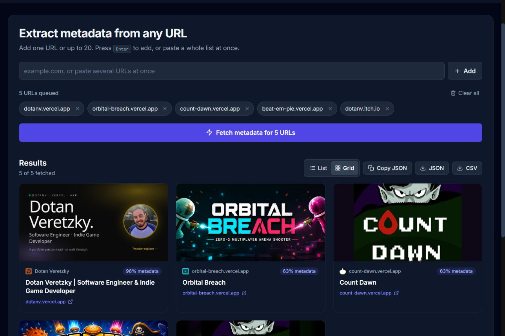

# 🌐 URL Metadata Fetcher

**Inspect, preview and audit the metadata behind any public URL.** Fetch one page or a batch of twenty, compare the tags each page publishes, inspect full-size preview images and export clean JSON or CSV.

[](https://github.com/DotanVG/react-node-url-metadata-fetcher/actions/workflows/ci.yml)
[](https://app.netlify.com/sites/react-node-url-mdata-fetch-dotanv/deploys)
[](LICENSE)

**[▶ Live app](https://react-node-url-mdata-fetch-dotanv.netlify.app/)** · **[API](https://react-node-url-metadata-fetcher.onrender.com/)**

---

## Table of contents

- [What it does](#what-it-does)
- [Screenshots](#screenshots)
- [Architecture](#architecture)
- [Quick start](#quick-start)
- [Configuration](#configuration)
- [API reference](#api-reference)
- [Error codes](#error-codes)
- [Testing](#testing)
- [Security](#security)
- [Deployment](#deployment)
- [Project layout](#project-layout)
- [Contributing](#contributing)
- [Origin](#origin)
- [License](#license)

## What it does

Give it a URL. It fetches the page, parses the markup and returns the metadata that page publishes about itself. Extraction prefers **Open Graph**, then **Twitter Cards**, then **JSON-LD**, then plain HTML, which is the order publishers usually curate.

- **One URL is enough.** Add a single link or batch up to 20.
- **Paste a whole list.** Newlines, commas, semicolons and spaces are split into separate URLs.
- **No scheme needed.** `example.com` becomes `https://example.com/`.
- **Nothing hides a failure.** A bad link comes back as its own error card with a plain-English reason; the rest of the batch is unaffected.
- **Wakes the API on load.** The backend sits on a free tier that sleeps after 15 minutes. The app pings it the moment the page opens and shows exactly what is happening while it boots, so your first click is never the one that waits.
- **Audits the tags, not just the values.** Every result carries a completeness breakdown showing which tags the page publishes, which values were inferred and which tags are absent. Each gap includes the tag needed to fix it.
- **Flexible image-first results.** Switch between a detailed list and a compact desktop grid. Click or tap a thumbnail to inspect the complete image in the center of the screen.
- **Export anywhere.** Copy as JSON, or download JSON/CSV (properly escaped, and hardened against spreadsheet formula injection).
- **Dark mode**, full keyboard support, and a layout that works on a phone.

## Screenshots

| Image grid | Detailed list |
| --- | --- |
|  |  |

The grid keeps preview images prominent and shows metadata completeness on every card. Select the completeness row or the card body to open the full result and metadata audit. The list view exposes descriptions, timing, destination links and the complete audit directly.


The full image preview opens only after a click, keyboard activation or tap. Close image and detail dialogs with their X button, the Escape key or a click outside the dialog. Mobile always uses the detailed list view.

## Architecture

```
┌────────────────────┐        POST /fetch-metadata        ┌──────────────────────┐
│  React + Vite SPA  │ ─────────────────────────────────▶ │  Express API         │
│  (Netlify)         │ ◀───────────────────────────────── │  (Render, free tier) │
│                    │        { results, summary }        │                      │
│  • wakes API on    │                                    │  • SSRF guard        │
│    load via /health│        GET /health                 │  • per-hop redirect  │
│  • sanitises text  │ ─────────────────────────────────▶ │    revalidation      │
│  • JSON/CSV export │                                    │  • timeout + size cap│
└────────────────────┘                                    │  • cheerio parsing   │
                                                          └──────────┬───────────┘
                                                                     │ HTTPS
                                                                     ▼
                                                              the public web
```

**Backend:** Node.js 24 LTS+, Express 4, Cheerio. No database; every request is stateless.

**Frontend:** React 18, Vite 6, Tailwind CSS 3. Uses the platform `fetch`, so there is no HTTP client dependency.

## Quick start

**Requirements:** Node.js 24 LTS or newer. Both the frontend and backend declare Node 24+ in their `engines` fields; `.nvmrc` files select Node 24. Node 24 ships with npm 11, which is suitable for the included lockfiles.

```sh
git clone https://github.com/DotanVG/react-node-url-metadata-fetcher.git
cd react-node-url-metadata-fetcher
```

Run the API:

```sh
cd Backend
npm install
npm start          # http://localhost:3000  (npm run dev to watch for changes)
```

Then, in a second terminal, run the app:

```sh
cd Frontend
npm install
npm run dev        # http://localhost:5173
```

The frontend talks to `http://localhost:3000` by default. To point it elsewhere, copy `Frontend/.env.example` to `Frontend/.env` and set `VITE_API_URL`.

## Configuration

Every knob is an environment variable; see `Backend/.env.example` and `Frontend/.env.example`.

### Backend

| Variable | Default | Purpose |
| --- | --- | --- |
| `PORT` | `3000` | Port to listen on |
| `ALLOWED_ORIGINS` | localhost + the deployed site | Comma-separated browser origins allowed by CORS |
| `MAX_URLS_PER_REQUEST` | `20` | Batch size limit |
| `FETCH_TIMEOUT_MS` | `10000` | Per-URL network budget |
| `MAX_HTML_BYTES` | `2097152` | Body size cap (2 MB) |
| `MAX_REDIRECTS` | `5` | Redirect hops before giving up |
| `FETCH_CONCURRENCY` | `5` | Parallel fetches per batch |
| `RATE_LIMIT_WINDOW_MS` | `60000` | Rate-limit window |
| `RATE_LIMIT_MAX` | `30` | Requests per window, per IP |
| `ALLOW_PRIVATE_ADDRESSES` | `false` | **Local development only.** Permits loopback/RFC1918 targets. Link-local and multicast stay blocked regardless. |

### Frontend

| Variable | Default | Purpose |
| --- | --- | --- |
| `VITE_API_URL` | `http://localhost:3000` | Base URL of the API |

## API reference

### `GET /`

Describes the service, its endpoints and current limits.

### `GET /health`

Liveness probe, and the endpoint the frontend uses to wake a sleeping instance. **Deliberately exempt from rate limiting**, so a wake-up ping can never lock a user out of the endpoint they are about to use.

```json
{ "status": "ok", "uptimeSeconds": 42, "timestamp": "2024-05-01T10:00:00.000Z" }
```

### `POST /fetch-metadata`

```http
POST /fetch-metadata
Content-Type: application/json

{ "urls": ["https://nodejs.org", "https://github.com/DotanVG"] }
```

Responds `200` with one result per URL, **in the order they were sent**:

```json
{
  "results": [
    {
      "url": "https://nodejs.org/en/about",
      "ok": true,
      "finalUrl": "https://nodejs.org/en/about",
      "status": 200,
      "elapsedMs": 175,
      "title": "Node.js | About Node.js®",
      "description": "Node.js® is a free, open-source, cross-platform JavaScript runtime environment that lets developers create servers, web apps, command line tools and scripts.",
      "image": "https://nodejs.org/en/next-data/og/announcement/Node.js%20%E2%80%94%20About%20Node.js%C2%AE",
      "imageAlt": "The Node.js Hexagon Logo",
      "siteName": "nodejs.org",
      "favicon": "https://nodejs.org/static/images/favicons/favicon.png",
      "type": "",
      "author": "",
      "publishedAt": "",
      "canonicalUrl": "https://nodejs.org/en/about",
      "locale": "en-GB",
      "themeColor": "",
      "keywords": [],
      "sources": {
        "title": "og",
        "description": "og",
        "image": "og",
        "imageAlt": "twitter",
        "siteName": "derived",
        "favicon": "html",
        "type": null
      },
      "audit": {
        "score": 71,
        "published": 7,
        "inferred": 1,
        "missing": 5,
        "total": 13,
        "missingEssential": [],
        "fields": [
          {
            "key": "title",
            "label": "Title",
            "tag": "og:title",
            "importance": "essential",
            "hint": "The headline every platform shows. Without og:title the page falls back to <title>.",
            "status": "published",
            "source": "og"
          }
        ]
      }
    }
  ],
  "summary": { "requested": 1, "succeeded": 1, "failed": 0 }
}
```

Fields a page does not publish come back as empty strings rather than being omitted, so every result has the same shape. `sources` and `audit.fields` are abridged above. `sources` names every field, and `audit.fields` carries one entry per audited tag.

### Metadata audit

Each successful result carries an `audit` grading what the page publishes.

**`sources`** names where each value actually came from: `og`, `twitter`, `jsonld`, `html`, or `derived`. That last one matters. `derived` means *we* worked the value out and the page never published it. `siteName` falls back to the hostname and `favicon` to `/favicon.ico`, so both are commonly `derived`.

**`audit.fields[].status`** is one of:

| Status | Meaning |
| --- | --- |
| `published` | The page declares this tag |
| `inferred` | We filled it in; the page never said |
| `missing` | Absent entirely |

**`audit.fields[].importance`** is `essential` (title, description and image; the preview breaks without them), `recommended`, or `optional`. The score weights them 3 / 2 / 1 and gives an inferred value half credit, so a page cannot score well by publishing a dozen trivial tags and no `og:image`. `missingEssential` lists just the headline problems.

A URL that could not be fetched is reported **in place**, not as a failed request:

```json
{
  "url": "https://example.com/missing",
  "ok": false,
  "elapsedMs": 91,
  "error": {
    "code": "HTTP_ERROR",
    "message": "The page was not found (404). Double-check the address.",
    "status": 404
  }
}
```

A malformed *request*, such as a missing `urls` key, a non-array, an empty batch or an oversized batch, returns `400` with an `error` object. Exceeding the rate limit returns `429` with `retryAfterSeconds`.

```sh
curl -X POST https://react-node-url-metadata-fetcher.onrender.com/fetch-metadata \
  -H 'Content-Type: application/json' \
  -d '{"urls":["https://nodejs.org/en/about"]}'
```

## Error codes

Every failure carries a stable `code` and a message written for a person, not a log file.

| Code | Meaning |
| --- | --- |
| `INVALID_URL` | Not parseable as a web address |
| `UNSUPPORTED_PROTOCOL` | Something other than `http:` or `https:` |
| `BLOCKED_HOST` | Resolves to a private or internal address |
| `DNS_ERROR` | Domain does not resolve |
| `CONNECTION_REFUSED` | Host refused the connection |
| `TIMEOUT` | Exceeded `FETCH_TIMEOUT_MS` |
| `TOO_MANY_REDIRECTS` | More hops than `MAX_REDIRECTS` |
| `HTTP_ERROR` | Non-2xx response (carries `status`) |
| `UNSUPPORTED_CONTENT_TYPE` | Not a web page, such as an image, PDF or binary file |
| `RESPONSE_TOO_LARGE` | Body exceeded `MAX_HTML_BYTES` |
| `NETWORK_ERROR` | Connection reset, TLS failure, and similar |

## Testing

```sh
cd Backend  && npm test    # Jest + supertest, against a local fixture site
cd Frontend && npm test    # Vitest + React Testing Library
cd Frontend && npm run lint
```

The backend suite runs against a fixture HTTP server started in-process, so it never depends on the network or on a third party keeping their markup stable. It covers metadata extraction and its fallback chain, every error code, the SSRF guard (including redirect-based bypass attempts), CORS, and rate limiting.

## Security

This service fetches arbitrary user-supplied URLs, which is exactly the shape of a **server-side request forgery** vulnerability. The defences:

- **Private address blocking.** Host names are resolved before the request, and any answer in loopback, RFC1918, carrier-grade NAT, link-local (including `169.254.169.254`, the cloud instance-metadata address), multicast or reserved space is refused.
- **Every redirect hop is re-validated.** An open redirect on a public site cannot walk the server into the private network, or off onto a `file:` URL.
- **Protocol allowlist.** Only `http:` and `https:`, at every hop.
- **Time and size limits.** A hung or enormous upstream cannot hold a worker or exhaust memory.
- **Even the escape hatch is narrow.** `ALLOW_PRIVATE_ADDRESSES` opens loopback for local development, but never link-local or multicast.

And around the edges: Helmet security headers, an origin allowlist for CORS, per-IP rate limiting, a 100 KB request body cap, output sanitising with DOMPurify before any remote text is rendered, `javascript:`/`data:` image URLs stripped server-side, and CSV export hardened against spreadsheet formula injection.

> **A note on CSRF:** earlier versions used `csurf`, which has been deprecated since 2022. It was removed rather than replaced. This API is stateless and credential-free. It has no cookies, sessions or logins to forge a request against, so a CSRF token protected nothing while adding a required round-trip that broke on cross-site cookie policies. The origin allowlist and rate limiting provide the protections that apply here.

## Deployment

**Backend to Render.** `render.yaml` at the repo root is a ready blueprint with `Backend` as the root directory and `/health` as the health check. Set `ALLOWED_ORIGINS` to your frontend's origin.

**Frontend to Netlify.** The Netlify site builds from `Frontend` with `npm run build` and publishes `Frontend/dist`. `Frontend/public/_redirects` provides the SPA fallback from inside the published output. Set `VITE_API_URL` in the Netlify environment.

Free-tier instances sleep after inactivity, which is why the app pings `/health` on load and tells the user what is happening instead of appearing broken.

## Project layout

```
Backend/
  server.js                 entry point + graceful shutdown
  src/
    app.js                  Express app, routes, middleware, error handling
    config.js               every tunable, read from the environment
    urlSafety.js            URL parsing + SSRF guard
    fetchPage.js            safe fetch: redirects, timeout, size cap, charset
    extractMetadata.js      OG → Twitter → JSON-LD → HTML extraction, with provenance
    auditMetadata.js        grades which tags a page publishes, infers or omits
    metadataService.js      bounded-concurrency batch runner
    errors.js               error codes and human-readable messages
  tests/                    Jest suites + in-process fixture site

Frontend/
  src/
    App.jsx                 composition and state
    components/             presentational components, incl. the audit panel
    hooks/                  useBackendStatus (wake-up), useTheme, usePersistentUrls
    lib/                    api client, URL parsing, JSON/CSV export
    tests/                  Vitest suites
```

## Contributing

Issues and pull requests are welcome, especially bug reports, additional metadata sources and clearer error messages.

```sh
cd Backend  && npm test
cd Frontend && npm run lint && npm test && npm run build
```

CI runs exactly those checks on every pull request.

To refresh the README screenshots, open the deployed app in Chrome, load the five sample projects and capture the grid, list, full-image and mobile states in `docs/screenshots`.

## Origin

This project began in August 2024 as a full-stack home assignment for [Tolstoy](https://www.gotolstoy.com): fetch metadata for at least three URLs and display it. It has since been rebuilt as a general-purpose tool—the three-URL minimum is gone, the backend was redesigned around SSRF-safe fetching and structured per-URL errors, and the frontend was substantially expanded. The original assignment version remains in the git history.

## License

[MIT](LICENSE) © Dotan Veretzky
