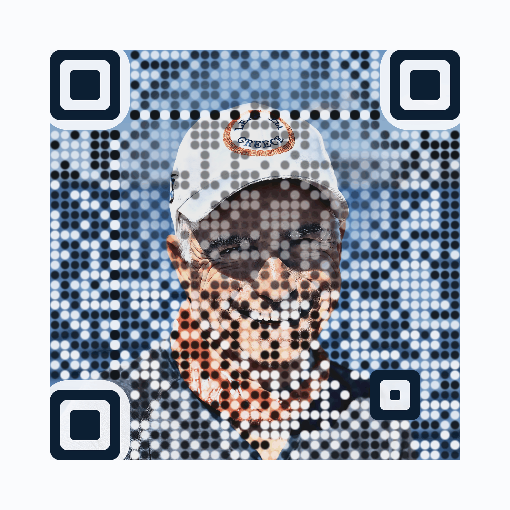

# Premium photo-embedded QR code



The picture is not a logo dropped into the middle of a plain QR code. The whole
symbol *is* the photograph: every module is a soft dot whose colour is the
photo's own colour pushed to the luminance a scanner needs, so the portrait
keeps reading through the lattice while the code stays inside its
error-correction budget.

| File | What it is |
| --- | --- |
| `premium-qr.png` | The symbol on its own, 2193 × 2193 |
| `premium-qr-card.png` | The symbol laid out as a printable sheet, 2200 × 2860 |
| `source/portrait.jpg` | The source photograph, downscaled and stripped of EXIF |
| `generate_premium_qr.py` | The generator, and the verification harness |

Both encode <https://react-node-url-mdata-fetch-dotanv.netlify.app/> at
QR version 6 (41 × 41 modules), error correction level **H**.

## Regenerating

```bash
python3 -m pip install -r docs/qr/requirements.txt
python3 docs/qr/generate_premium_qr.py            # render, then verify
python3 docs/qr/generate_premium_qr.py --verify-only
```

Every knob lives in the `Style` dataclass, and the useful ones are also flags:
`--data`, `--photo`, `--crop`, `--colors`, `--headline`. Radii and filter sizes
are expressed in *module units*, so changing `module_px` rescales the artwork
without changing how it looks.

## How it holds together

**Colour-preserving targets.** A dark module scales the photo's colour down to
the target luminance and a light module lifts it toward white, both along the
same hue. Nothing is flattened to black and white, which is why the sea stays
blue and the bandana stays orange.

**Dots sized by need.** Each module is measured against the value it has to
carry. Where the photo already agrees, the dot shrinks and blends more gently
and the picture keeps its own detail; where the photo disagrees, the dot goes
to full size and full strength.

**A soft focus region over the face.** Inside an ellipse over the subject the
lattice eases off to 48%, so the portrait survives — the cap badge is still
readable. This is the one deliberate spend of error-correction budget: it costs
about 6% of modules against level H's ~30% tolerance.

**Three constraints the artwork is not allowed to cross.** Each of these was
found by measurement, not taste, and each is commented at its definition:

- Finder-pattern corner rounding stops at 1.0 module. Past that the finder no
  longer scans as the 1:1:3:1:1 run-length ratio detectors look for, and the
  symbol becomes undetectable even though its data is perfect.
- The timing runs are drawn at full strength and a size up. They are what a
  decoder walks to recover the module grid; softening them with the rest of the
  lattice was worth 8 decodes out of 45.
- Grain finer than a module is removed with an edge-preserving filter. It
  carries no picture at this scale but reads as noise to a binariser.

## Verification

`generate_premium_qr.py` decodes what it just wrote, across 45 conditions per
file: nine sizes from 1400px down to 220px, each as-is, blurred, rotated 11°,
JPEG-compressed at quality 55, and put through a simulated phone capture
(perspective warp, uneven lighting, sensor noise).

Both files decode **45/45 with zxing-cpp**, the ZXing C++ engine that production
scanners are built on. The same harness also reports OpenCV's classic
`QRCodeDetector` as a deliberately harsh second opinion — it is much weaker on
textured symbols and does not represent what a phone will do.
